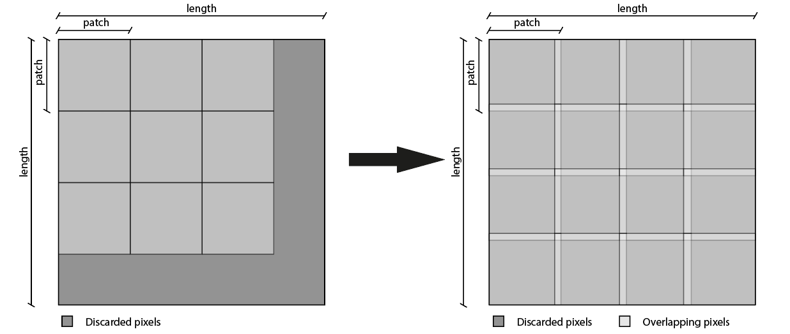

# image2patch
`image2patch` can split the image in different patches with automatic detection of the best step in order to avoid pixels loss. The overlap between patches depends on the patch size.
Alternatively, it is possible to choose the step which leads to a possible pixels loss.  
The reconstruction of the original image is possible using `patch2image` which can merge the patches taking into account the overlap percentage among patches, in this way the original image is perfectly restored. 

## Example


## Installation
```Python
pip install image2patch
```
```Python
from image2patch import image2patch
```
```Python
from image2patch import patch2image
```
## How to use it
`image2patch(image, patch_size, step=None, verbose=False)`

In particular:
- image : input image which can be a 2D or 3D array
- patch_size : dimension of the window
- step : the distance from one step to another, if =None it will be automatically detected in order to avoid pixels loss. If set = patch_size it will provide patches without overlapping but with pixels loss depending on the size of the input image. 
- verbose : if =True it provides details. 
 

`patch2image(image, patch_size, step=None)`

In particular:
- image : input image which can be a 2D or 3D array
- patch_size : dimension of the window
- step : the distance from one patch to another used in `adaptivepatch`

 
## Licence
[MIT](https://choosealicense.com/licenses/mit/)

